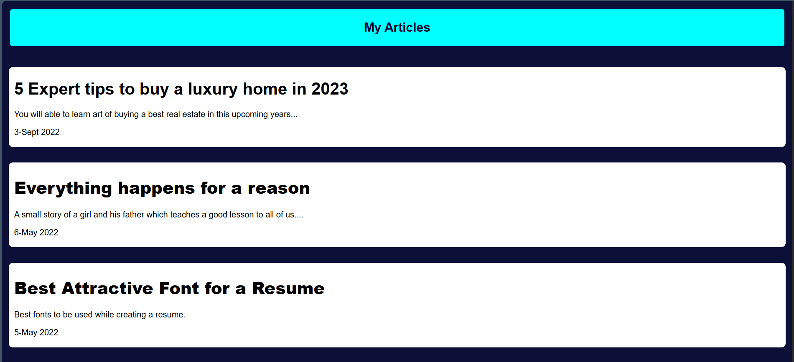

# Portfolio Website

A **responsive, personal portfolio website** built with basic HTML, CSS, and JavaScript.

Showcase your skills, projects, and contact info in a clean and interactive format. This project is ideal for deploying on GitHub Pages to establish your web presence.

---

## 🚀 Features

- **Homepage:** Short introduction with links to key sections.
- **About:** Brief bio, skills, and interests.
- **Projects:** Gallery/list of projects with descriptions and links.
- **Contact:** Email/contact form (front-end only).
- **Responsive design:** Mobile, tablet, and desktop friendly.
- **Smooth navigation and simple interactivity** with vanilla JS.

## 📸 Project Previews

### Homepage

### About Section

### Work Experience

### Designs Gallery

### Articles Gallery

### Contact Form

